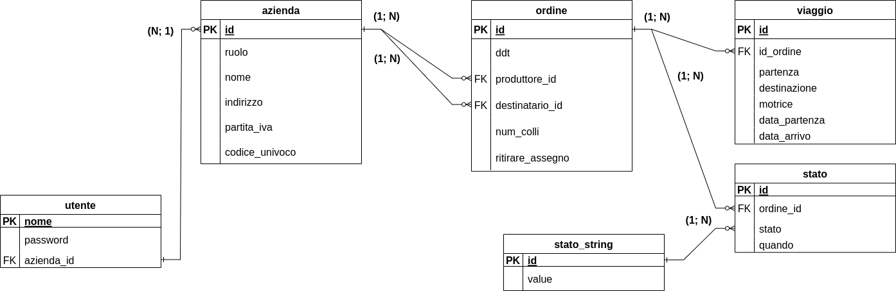
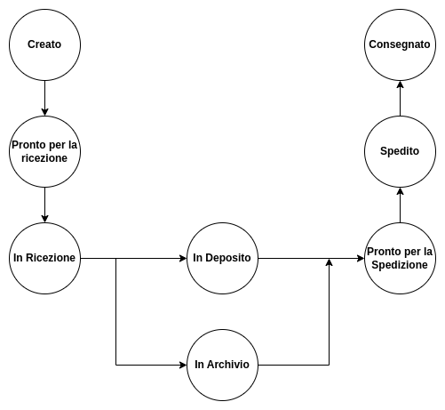

# Gestionario Ordini azienda di trasporti

## Giovanni Spera

L'obbiettivo del gestionale è la creazione di un applicativo web che migliori la gestione delle aziende e effettui il **warehouse** degli ordini.

#### Utente
Diverse persone potranno usare l'applicativo, è quindi necessario avere un riferimento all'azienda, in basa alla qualce vedranno dati e operazioni diverse.

#### Un Azienda,
analogamente, ha un *ruolo*, che definisce se l'azienda è un mittente o un destinatario o se è l'azienda di logistica stessa.  
Questo campo è controverso e potrebbe essere rimosso.

Per permettere una comoda gestione delle aziende, (per esempio quando bisogna emettere fattura) conserviamo la *partita iva* e il *codice univoco*.

#### Un Ordine,
oltre ad un identificativo univoco possiede il *ddt* che lo identifica lato utente. Inoltre sono presenti i riferimenti all'azienda produttrice e destinataria.

Inoltre conserviamo il *numero di colli* come metadato, utile per assicurarsi che tutto l'ordine sia gestito assieme, *ritirare l'assegno* invece permette di ricordare ai diversi autisti che durante la consegna bisogna ritirare il relativo assegno.

#### Il Viaggio,
contiene l'*identificativo dell'ordine* a cui si riferisce, ha la posizione di partenza e destinazione, al momento gestita come stringa ma potrebbe essere estrapolata, conseriamo la *motrice* effettuata durante il viaggio per permettere una migliore gestione interna all'azienda.
Inoltre si conserva la *data di partenza* e la *data di arrivo* per poter costire lo storico.

#### Lo Stato,
infine rappresenta un aggiornamento dell'ordine, è estrapolato dal viaggio in quanto un viaggio potrebbe non causare una varazione di stato, inoltre ricordiamo *quando* è avvenuto il cambiamento.

Il valore che può essere assunto da uno stato è conservato in **stato_string** che si occupa quindi di associare il valore numerico al corrispettivo valore testuale, i valori che lo stato può assumere sono:

- 0: Creato
- 1: Pronto per essere ricevuto
- 2: In ricezione
- 3: In deposito
- 4: In archivio
- 5: Pronto per essere spedito
- 6: Spedito
- 7: Consegnato

## Vincoli
- Un azienda non può avere un *nome* vuoto(ma potrebbe avere una *partita_iva* o un *codice_univoco* vuoto)
- Un Ordine ha un numero di colli maggiore di zero
- Un Ordine non può avere *produttore_id* uguale a *destinatario_id*
- In un Viaggio la data di arrivo deve essere successiva a quella di partenza
- Un Viaggio deve avere la *partenza* e la *destinazione* diversi tra di loro e non vuoti.
- Stato può avere uno stato valido(registrato in stato_string)
