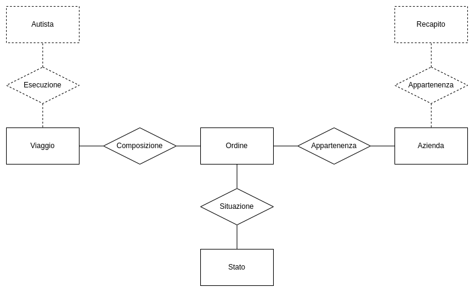
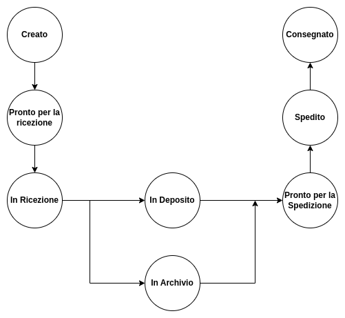

# Progetto Basi di Dati

Si vuole progettare un database per la gestione degli ordini di un azienda di trasporti per permettere ai vari utenti di conoscere in tempo reale lo stato del trasporto.
La struttura è pensata per essere estensibile, in modo da adempiere, in futuro, ad una gestione espansa dell'azienda.

### Glossario
- **Collo**:Un collo è un oggetto che va trasportato e che fa parte di un ordine.
- **Ordine**: Uno o più colli che vengono trasportati.
- **Viaggio**: Spostamento di uno o più ordini da una locazione ad un altra.
- **Trasporto**: Insieme di viaggi che portano un ordine dalla locazione di origine a quella di destinazione.
- **Deposito**: Luogo dove sostano gli ordini a breve termine.
- **Archivio**: Luogo dove sostano gli ordini a lungo termine, cioè che non vanno spediti in un breve lasso di tempo.

### Struttura Scheletro

La struttura principale è l'**ordine** che dovrà contenere tutte le informazioni pertinenti(partenza, destinazione etc...), un ordine è *composto* da più **viaggi** che si occupano di muovere l'ordine nelle varie destinazioni intermedia. Un ordine inoltre *appartiene* ad un **azienda**, ciò permette di identificare tutti gli ordini provenienti da una stessa azienda e di non rindondare diverse informazioni. Inoltre, un ordine *si trova* in uno **Stato**, questo stato identifica in qualche fase del trasporto l'ordine si trova.
Le sezioni trattegiate indicano possibili future estensioni.

Un ordine viene **creato**, quindi immesso nel sistema, ma potrebbe ancora non essere **pronto per la ricezione** da parte della nostra azienda. Quando possibile allora questo verrà **ricevuto** e verrà trasportato in **deposito** o in **archivio**. Successivamente l'ordine sarà **pronto per essere spedito**, successivamente ancora verrà **spedito** e infine **consegnato**.
